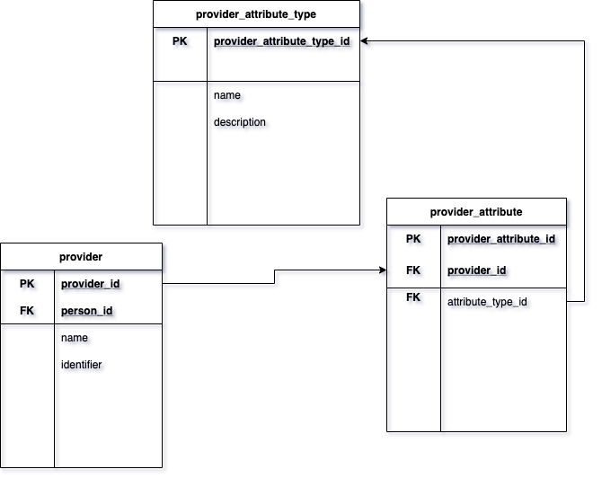

# ADR-0001: Add additional data to resource

## Status

- This ADR has been approved.

- This has been implemented for a practitioner, but not for any other resource - the implementation for the Patient resource has been identified as an [issue](https://github.com/Open-GP/opengp-architecture/issues/21).
 
## Context

Deprecated design:

- For each resource, we extended the existing resource by creating a new table in the OpenMRS database called nhs_{resource} (e.g. nhs_patient and nhs_practitioner).

The problem:

- When we identified a one-to-many relationship between a resource and a data field (between the Practitioner and the SDS Role Profile Id field), the current solution would have required making further changes to the OpenMRS model.

- These changes would have included creating a new table to hold instances of the SDS Role Profile Id field.

- However, this would have made the Practitioner resource more complex.\*

\* For context, a Practitioner resource in FHIR is equivalent to a provider in OpenMRS.

## Decision

- We decided to use the existing OpenMRS model for creating attributes for each resource.

- There is a one-to-many relationship between a resource and its attributes.

- Each attribute has an attribute type, which is stored in the attribute_type table.

- For each new piece of data to be added to a resource:
    - Create a new attribute_type that describes the data type - this should be included in the seed data.
    - Create a new attribute with the attribute_type that you just created and link this new attribute to your resource.
    - Update the translator for the resource (from FHIR to OpenMRS and vice versa) to ensure that the new piece of data is populated.
    
- Please see [the addition of the SDS Role Profile Id field to the Practitioner resource](https://github.com/Open-GP/openmrs-module-gpconnect/commit/f0ff30c18f0d386e338d87f22a847b0dc3dff5ff) to see an implementation of the following pattern:

## Consequences

Advantages of decision:

- It uses the existing OpenMRS design - we won't have to change the OpenMRS model to add data to each of our resources.

- It is a more flexible design - as part of the OpenMRS model design, the attribute stores a reference value that can used to reference fields on other tables if needed.

Disadvantages of decision:

- It is more difficult to understand where data fields are if the OpenMRS model is not known - it will become more difficult to find resource data fields as they are not explicitly defined in the model.
